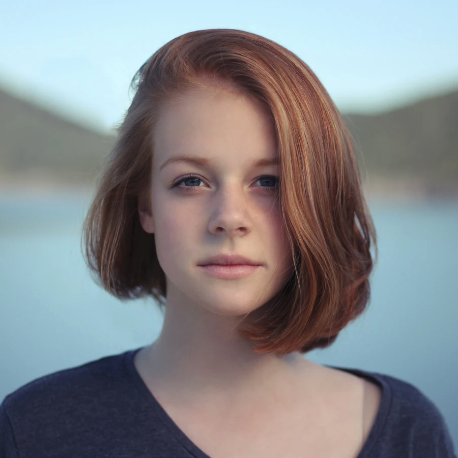

# Eliška Šídlová

Very primitive Discord bot, which was developed over one evening for one-time rename of all users on our server.

[Dostupné česky](README.cs.md)

**How does it work?**

Files `{fe,}male_{sur,}names.py` contain lists of czech names and surnames. For every user, the bot decides whether it will assign a male or female name and then picks one.

**How to make it work?**

Create new bot on [Discord Developers](https://discord.com/developers), copy its token and invite it on your server. *Make sure the bot's role is above everyone else, else it won't have the permission to change anything.*

Download the bot:
```bash
# clone repository
git clone git@github.com:sinus-x/EliskaSidlova.git
cd EliskaSidlova
# create venv; optional, but recommended
python3 -m venv .venv
source .venv/bin/activate
# install required packages
python3 -m pip install -r requirements.txt
```

Create file `info.py` and insert neccesary information:
```py
token = "my.secret.discord.token"
```

Run the bot with
```bash
python bot.py
```

**Commands**

| command  | description                          |
|----------|--------------------------------------|
| $help    | display help                         |
| $send #channel {text} | send text to given channel |
| $ping    | display API latency                  |
| $rename  | change name of all users             |
| $restore | change names back to their originals |

The renaming will take some time, we observed it to be around 56 members per minute.

**Why the name?**

The bot picked it itself when it was run for the first time. It can be roughly translated as "Elisabeth Awl".

**Data source**

The lists come from Czech republic's Home Office website. Because of the GDPR regulation the data is not available anymore, but the old, 2006 version can be retrieved via the Web Archive.

**License**

[MIT](LICENSE).

Author of the photo/avatar is Christopher Campbell, see the [Unsplash post](https://unsplash.com/photos/rDEOVtE7vOs).
